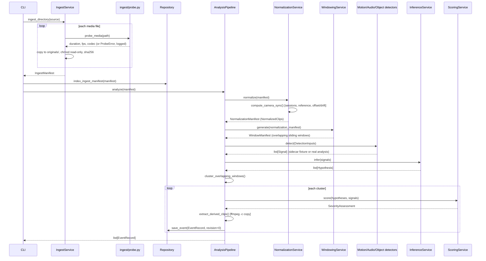
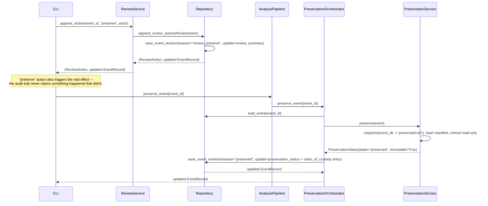
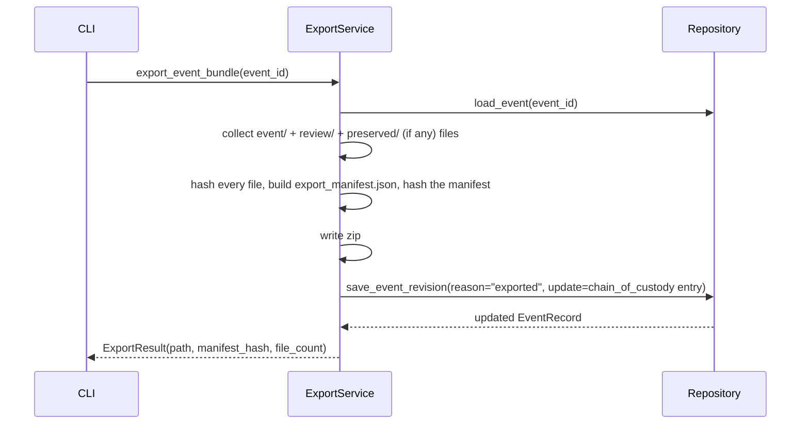

# Sequence diagrams

## `ingest` -> `analyze`

```mermaid
sequenceDiagram
    participant CLI
    participant IngestService
    participant probe as ingest/probe.py
    participant Repository
    participant AnalysisPipeline
    participant NormalizationService
    participant WindowingService
    participant Detectors as Motion/Audio/Object detectors
    participant InferenceService
    participant ScoringService

    CLI->>IngestService: ingest_directory(source)
    loop each media file
        IngestService->>probe: probe_media(path)
        probe-->>IngestService: duration, fps, codec (or ProbeError, logged)
        IngestService->>IngestService: copy to originals/, chmod read-only, sha256
    end
    IngestService-->>CLI: IngestManifest
    CLI->>Repository: index_ingest_manifest(manifest)

    CLI->>AnalysisPipeline: analyze(manifest)
    AnalysisPipeline->>NormalizationService: normalize(manifest)
    NormalizationService->>NormalizationService: compute_camera_sync() [sessions, reference, offset/drift]
    NormalizationService-->>AnalysisPipeline: NormalizationManifest (NormalizedClips)

    AnalysisPipeline->>WindowingService: generate(normalization_manifest)
    WindowingService-->>AnalysisPipeline: WindowManifest (overlapping sliding windows)

    AnalysisPipeline->>Detectors: detect(DetectionInputs)
    Detectors-->>AnalysisPipeline: list[Signal] (sidecar fixture or real analysis)

    AnalysisPipeline->>InferenceService: infer(signals)
    InferenceService-->>AnalysisPipeline: list[Hypothesis]

    AnalysisPipeline->>AnalysisPipeline: cluster_overlapping_windows()
    loop each cluster
        AnalysisPipeline->>ScoringService: score(hypotheses, signals)
        ScoringService-->>AnalysisPipeline: SeverityAssessment
        AnalysisPipeline->>AnalysisPipeline: extract_derived_clips() [ffmpeg -c copy]
        AnalysisPipeline->>Repository: save_event(EventRecord, revision=0)
    end
    AnalysisPipeline-->>CLI: list[EventRecord]
```

## Review action (`preserve`)

```mermaid
sequenceDiagram
    participant CLI
    participant ReviewService
    participant Repository
    participant AnalysisPipeline
    participant PreservationOrchestrator
    participant PreservationService

    CLI->>ReviewService: append_action(event_id, "preserve", actor)
    ReviewService->>Repository: append_review_action(ReviewAction)
    Repository->>Repository: save_event_revision(reason="review_preserve", update=review_summary)
    Repository-->>ReviewService: (ReviewAction, updated EventRecord)
    ReviewService-->>CLI: (ReviewAction, updated EventRecord)

    Note over CLI: "preserve" action also triggers the real effect --<br/>the audit trail never claims something happened that didn't.
    CLI->>AnalysisPipeline: preserve_event(event_id)
    AnalysisPipeline->>PreservationOrchestrator: preserve_event(event_id)
    PreservationOrchestrator->>Repository: load_event(event_id)
    PreservationOrchestrator->>PreservationService: preserve(event)
    PreservationService->>PreservationService: copytree(event_dir -> preserved/<id>), hash manifest, chmod read-only
    PreservationService-->>PreservationOrchestrator: PreservationStatus(state="preserved", immutable=True)
    PreservationOrchestrator->>Repository: save_event_revision(reason="preserved", update=preservation_status + chain_of_custody entry)
    Repository-->>PreservationOrchestrator: updated EventRecord
    PreservationOrchestrator-->>CLI: updated EventRecord
```

## Export

```mermaid
sequenceDiagram
    participant CLI
    participant ExportService
    participant Repository

    CLI->>ExportService: export_event_bundle(event_id)
    ExportService->>Repository: load_event(event_id)
    ExportService->>ExportService: collect event/ + review/ + preserved/ (if any) files
    ExportService->>ExportService: hash every file, build export_manifest.json, hash the manifest
    ExportService->>ExportService: write zip
    ExportService->>Repository: save_event_revision(reason="exported", update=chain_of_custody entry)
    Repository-->>ExportService: updated EventRecord
    ExportService-->>CLI: ExportResult(path, manifest_hash, file_count)
```
